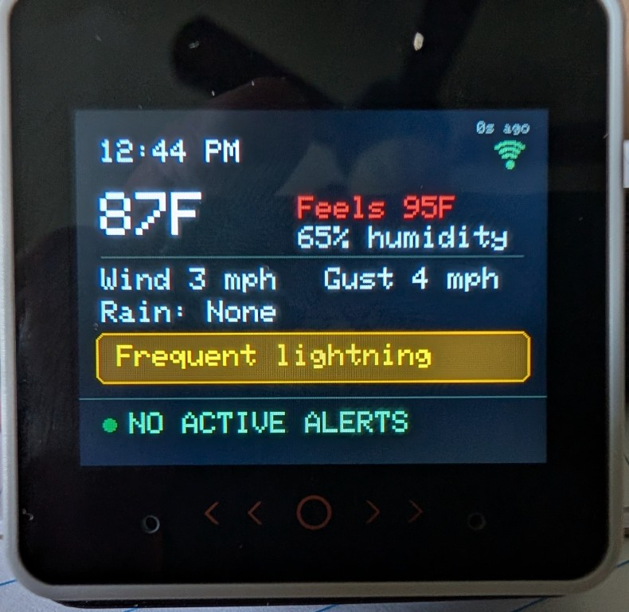
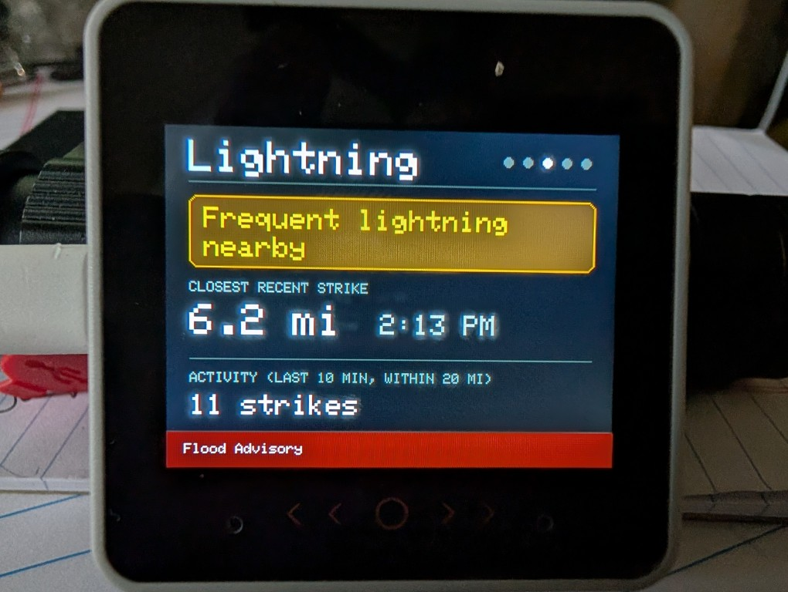
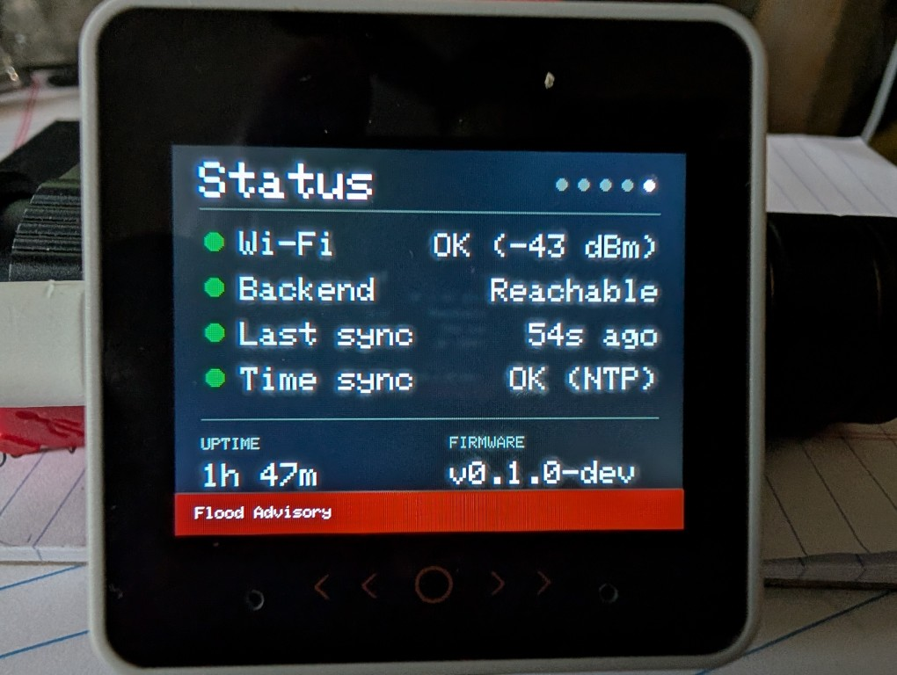

# Weather Sentinel



A bedside weather and alert appliance built on the M5Stack CoreS3 SE. It answers three
questions without becoming a full weather platform:

1. **What's happening in the yard right now?** — real-time conditions from a WeatherFlow
   Tempest station (temperature, feels-like, humidity, wind, gust, rain rate, station
   pressure), using WeatherFlow's own published formulas so the numbers agree with the
   Tempest phone app.
2. **Is a locally measured condition becoming noteworthy?** — Tempest-derived threshold
   events, starting with nearby lightning (filtered to within 10 miles, classified as
   sporadic or frequent rather than shown as raw numbers).
3. **Is an official NWS alert currently in effect?** — polled from the National Weather
   Service's public API for the local zone, with full lifecycle tracking (new, updated,
   escalated, expired) and acknowledgement.

The device stays dark and quiet during ordinary bedroom use and becomes conspicuous only
when conditions actually warrant it. It's explicitly **supplemental** — Wireless Emergency
Alerts, weather apps, NOAA Weather Radio, and other existing warning methods remain
independent and are never represented as replaced.





## How it's built

Two independent pieces, connected over the local network:

- **`firmware/`** — runs on the CoreS3 SE itself (ESP32-S3, PlatformIO + Arduino,
  M5Unified/M5GFX for display and touch). Connects to Wi-Fi, polls the backend every 60
  seconds, and renders five screens: a glanceable "Now" view plus four detail pages (Wind
  & Rain, Lightning, NWS Alerts, Status). Time is synced via NTP.
- **`server/`** — a small always-on Python/Flask service, deployed to a NAS via Docker/
  Portainer. Listens directly for the Tempest hub's local UDP broadcast (no cloud API
  call, no token needed) and separately polls the NWS API, exposing both as a single
  compact JSON endpoint (`GET /api/conditions`) the device consumes.

Running its own backend (rather than depending on other household dashboards) means the
device stays useful even if other, less consistently-running services are offline
overnight.

## Current status

The firmware and server are deployed, connected, and have both been exercised against
real conditions, not just simulated ones:

- All five screens display live data on real hardware — including a real NWS alert
  (received, displayed, acknowledged, and correctly not re-sounded after a server
  restart) and real lightning strikes.
- Alert acknowledgement is wired up end to end: a tap on the device calls the server's
  ack endpoint, and the acknowledgement survives a server redeploy.
- The server distinguishes "no active alerts" from "couldn't check," and the firmware
  carries that distinction through to every screen via a shared set of freshness rules —
  stale data is never allowed to read as a fresh "clear."
- Wi-Fi loss is handled automatically: the device retries on its own schedule, resyncs
  its clock on reconnect, and forces an immediate data refresh rather than waiting on an
  unrelated timer, with a reboot only as a last resort after 10 minutes of continuous
  failure — confirmed by physically walking the device out of Wi-Fi range and back.
- Both the UDP listener (Tempest) and the NWS poller survive malformed or unexpected
  data without stopping.

**Not yet built** (see "Planned upgrades" below): night dimming, audio, an on-device
Settings page, a simulation/test mode, and alert severity-aware display (today every
active alert looks equally urgent, regardless of how serious it actually is).

## Planned upgrades

Roughly in build order (see the project brief, §24, for the full v1.0 definition and
acceptance tests):

1. **Wi-Fi/NTP reconnect** — done (above). **Simulation/test mode** — not yet built; the
   only way to exercise long alerts, multiple alerts, escalation, and acknowledgement on
   the physical screen without waiting for real weather.
2. **Night dimming and a minimal on-device Settings page** — volume, day/night
   brightness with a night schedule, temporary mute, and a "run test alert" control. A
   4-page mockup has been reviewed; not yet built.
3. **Audio** — tones by alert level, silenced by acknowledgement, with volume, quiet
   hours, and an always-visible mute state.
4. **Alert priority and severity** — show the highest-priority alert first when more than
   one is active, and vary color by severity so a minor statement doesn't look like a
   tornado warning.

**After v1.0:** ambient alert-color LEDs (an M5GO-BOTTOM3 add-on), matching alerts to
the device's exact location rather than the whole county, and a captive portal for Wi-Fi
setup (replacing the current gitignored-header approach below).

## Repo layout

```
n4mi-weather-sentinel/
├── .gitignore
├── README.md
├── Weather_Sentinel_Project_Brief.md
├── firmware/
│   ├── platformio.ini
│   └── src/
│       ├── main.cpp
│       ├── wifi_credentials.h            (gitignored — real credentials)
│       └── wifi_credentials.h.example    (placeholder template)
└── server/
    ├── weather_sentinel_server.py
    ├── Dockerfile
    └── docker-compose.yml
```

## Building the firmware

```powershell
platformio run -d "D:\Documents\GitHub\n4mi-weather-sentinel\firmware" -t upload --upload-port COM15
```

Copy `firmware/src/wifi_credentials.h.example` to `wifi_credentials.h` and fill in real
Wi-Fi credentials **and** `SERVER_BASE_URL` (your server's LAN address and port, e.g.
`http://192.168.1.50:8085`, no trailing slash) before building — the build fails with a
clear error if `SERVER_BASE_URL` is missing. This stopgap will eventually be replaced by
an on-device captive portal for real bedside deployment.

## Running the server

Deployed via Portainer's Repository build method (see the project brief for the exact
walkthrough). Requires one environment variable, `NWS_CONTACT_INFO`, in the format NWS
requests: `(appname, contact@email.com)`. An optional `LIGHTNING_FILTER_RADIUS_MI`
(default 10) sets the lightning distance cutoff in miles; the compose file must pass
Portainer's value through (`LIGHTNING_FILTER_RADIUS_MI=${LIGHTNING_FILTER_RADIUS_MI:-10}`
under `environment:`) or it never reaches the container. No API keys or tokens are
needed for either Tempest or NWS.
