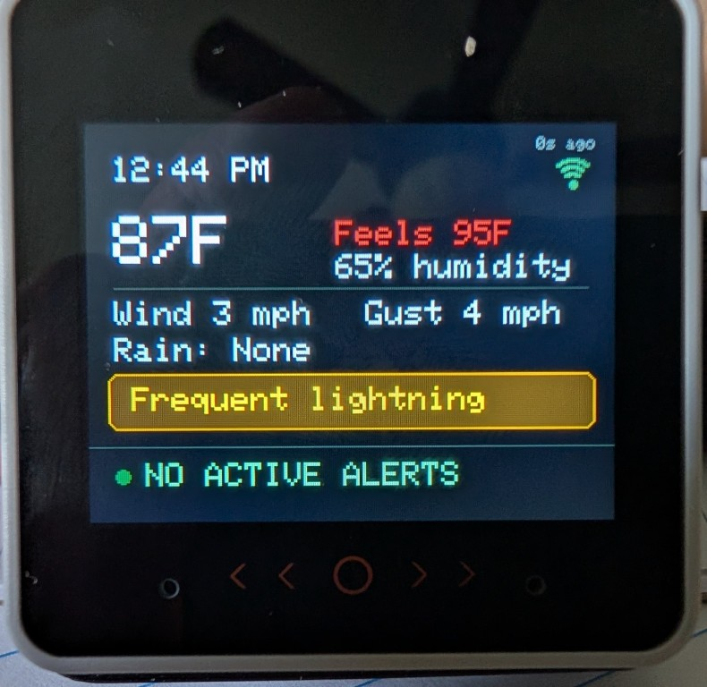
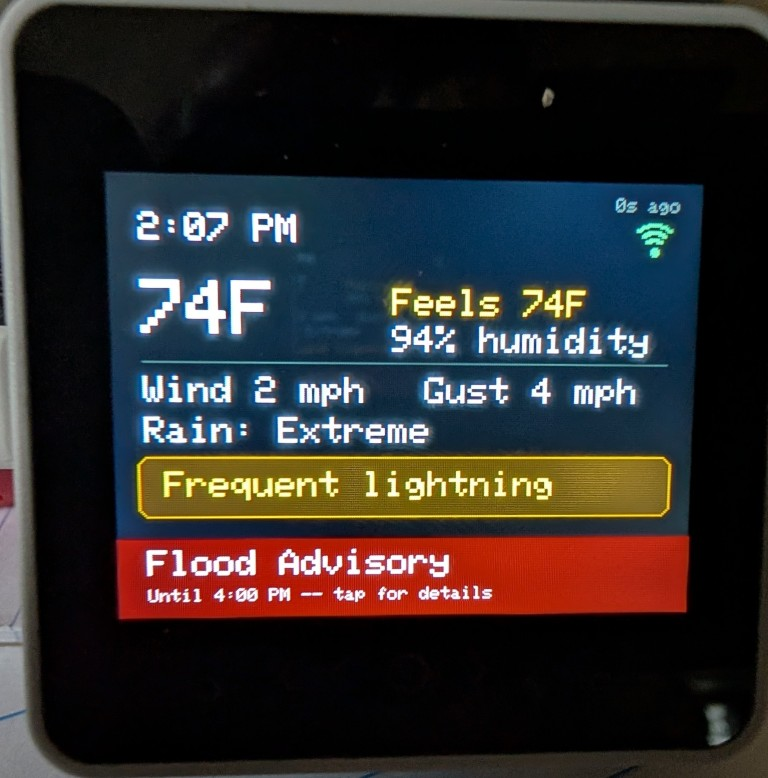
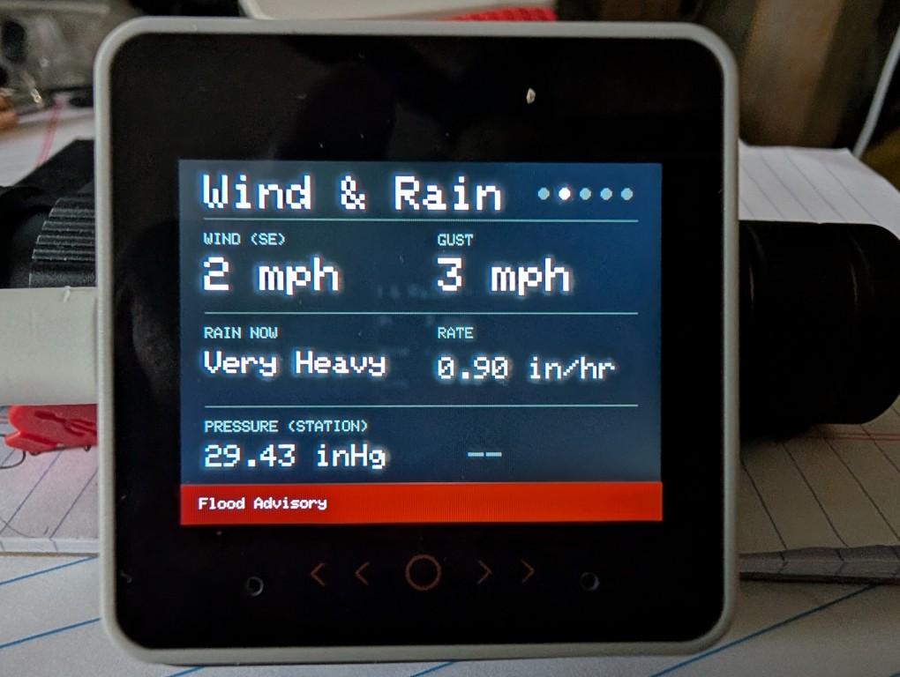
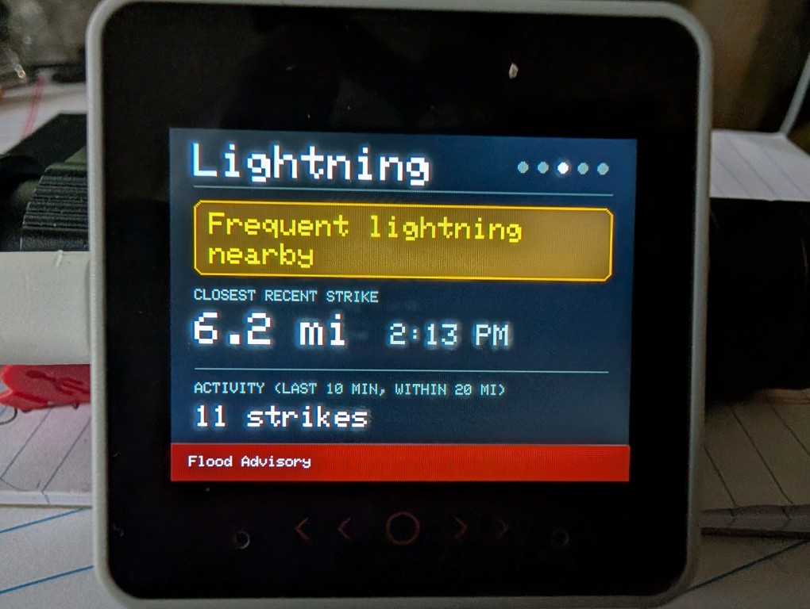
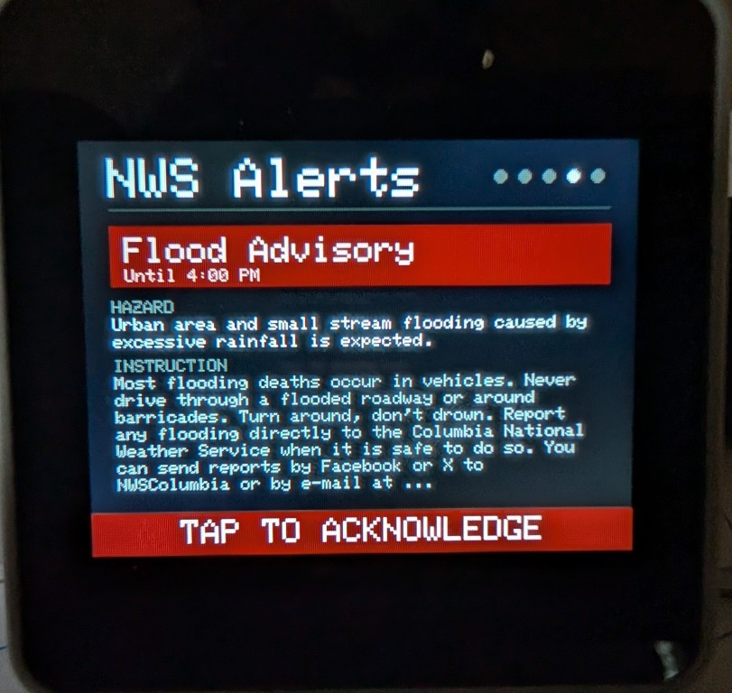
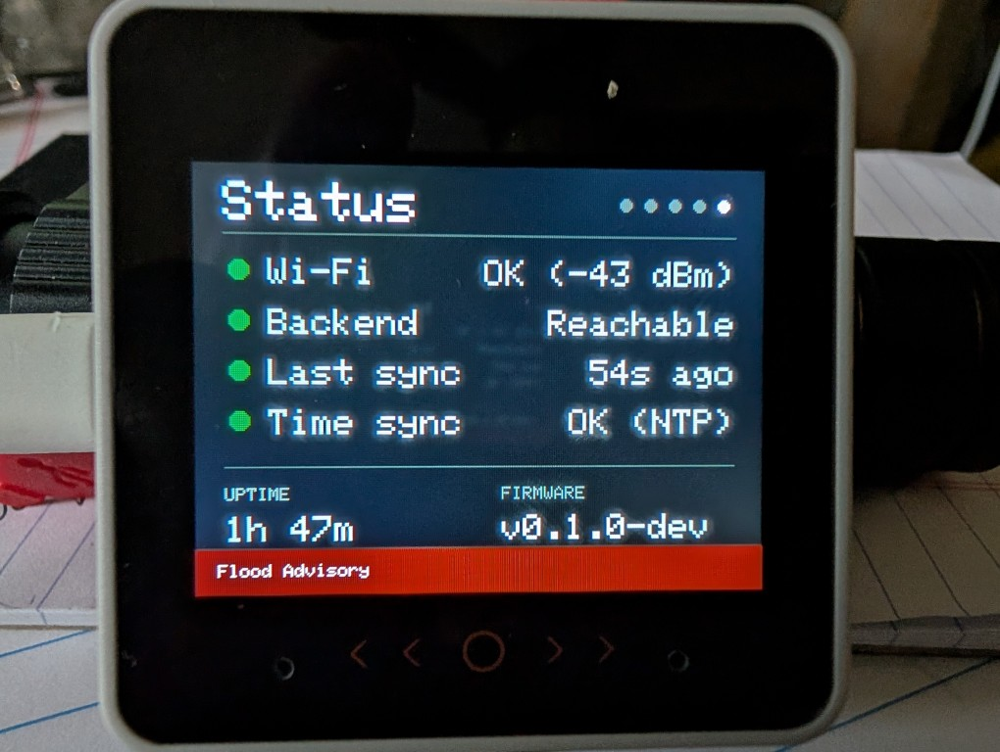

# Weather Sentinel



A bedside weather and alert appliance built on the M5Stack CoreS3 SE. It answers three
questions without becoming a full weather platform:

1. **What's happening in the yard right now?** — real-time conditions from a WeatherFlow
   Tempest station (temperature, feels-like, humidity, wind, gust, rain rate, station
   pressure), using WeatherFlow's own published formulas so the numbers agree with the
   Tempest phone app.
2. **Is a locally measured condition becoming noteworthy?** — Tempest-derived threshold
   events, starting with nearby lightning (filtered by distance, classified as sporadic or
   frequent rather than shown as raw numbers).
3. **Is an official NWS alert currently in effect?** — polled from the National Weather
   Service's public API for the local zone, with full lifecycle tracking (new, updated,
   escalated, expired), acknowledgement, tones by severity, and a 24-hour alert history.

The device stays dark and quiet during ordinary bedroom use and becomes conspicuous only
when conditions actually warrant it. It's explicitly **supplemental** — Wireless Emergency
Alerts, weather apps, NOAA Weather Radio, and other existing warning methods remain
independent and are never represented as replaced.







*These photos predate the severity colours: the Flood Advisory shown in red would now
appear in amber.*

## How it's built

Two independent pieces, connected over the local network:

- **`firmware/`** — runs on the CoreS3 SE itself (ESP32-S3, PlatformIO + Arduino,
  M5Unified/M5GFX for display, touch and audio). Connects to Wi-Fi, polls the backend
  every 60 seconds, and renders a glanceable "Now" view plus four detail pages (Wind &
  Rain, Lightning, NWS Alerts, Status), with a Settings area reached by a one-second
  long-press. Time is synced via NTP.
- **`server/`** — a small always-on Python/Flask service, deployed to a NAS via Docker/
  Portainer. Listens directly for the Tempest hub's local UDP broadcast (no cloud API
  call, no token needed), polls the NWS API, classifies and tracks alerts, and exposes it
  all as compact JSON the device consumes.

Running its own backend (rather than depending on other household dashboards) means the
device stays useful even if other, less consistently-running services are offline
overnight.

## What it does today

All of this is built and confirmed on the real device:

- **Live conditions and lightning** on every screen, including real NWS alerts and real
  lightning strikes.
- **Severity at a glance.** Warnings and Critical alerts are red; Watches, Advisories and
  Special Weather Statements are amber. Lightning uses a different *shape* (an outlined,
  rounded box) so it's never mistaken for an official alert.
- **Several alerts at once.** The most important one is shown first ("+2 more" tells you
  there are others), and a new alert that needs attention jumps to the top until it's
  acknowledged.
- **Alert tones by severity.** Critical: three tones, repeating for up to two minutes.
  Warning: two tones. Watch: one chime. Advisories and statements are silent. A tap on
  **TAP TO ACKNOWLEDGE** stops the sound, and the acknowledgement survives a server
  restart — an alert never sounds again as if it were new.
- **Alert History.** The last 24 hours of alerts, with the full text of each. Open it
  from Settings (page 5), or tap the coloured alert block on the NWS Alerts page when it
  shows "+N more >".
- **Night mode.** The screen dims automatically overnight. Quiet hours share the same
  schedule: Warnings and Critical alerts always sound; Watch chimes are silenced
  overnight.
- **Settings on the device:** volume and a test tone, a temporary one-hour mute, a
  **Run Test Alert** button, day/night brightness, and the night schedule. (Settings
  reset to defaults on reboot for now.)
- **An unmistakable test mode.** Simulations are served by the server and drawn with a
  magenta border and a **SIMULATION** tag. A real NWS alert automatically ends any
  running simulation, so a test can never hide a real warning.
- **Honest failure states.** "No active alerts" is shown only after a fresh, successful
  check. Otherwise the device says what's wrong — Wi-Fi disconnected, server unreachable,
  NWS status unknown, or data not current — and an active alert is never hidden because
  a check failed.
- **Self-recovery.** After a Wi-Fi drop the device retries on its own schedule, resyncs
  its clock, and refreshes immediately once it reconnects, with a reboot only as a last
  resort after 10 minutes of continuous failure.

## Road to v1.0 and beyond

Every v1.0 feature is built. What remains before declaring v1.0 is a set of acceptance
tests: a 72-hour continuous run, router and server outages, a power cycle with an alert
active, and a daytime audio bench test.

**Still open:** a small mute indicator on every screen (today mute shows only in
Settings), and saving Settings across reboots.

**After v1.0:** ambient alert-colour LEDs (an M5GO-BOTTOM3 add-on), matching alerts to
the device's exact location rather than the whole county, and a captive portal for Wi-Fi
setup (replacing the header-file approach below).

## Repo layout

```
n4mi-weather-sentinel/
├── .gitignore
├── README.md
├── images/                             (device photos used above)
├── firmware/
│   ├── README.md                       (build, upload and hardware notes)
│   ├── platformio.ini
│   └── src/
│       ├── main.cpp
│       ├── wifi_credentials.h          (gitignored — real credentials)
│       └── wifi_credentials.h.example  (placeholder template)
└── server/
    ├── README.md                       (deployment, settings, endpoints, tests)
    ├── weather_sentinel_server.py
    ├── Dockerfile
    ├── docker-compose.yml
    └── tests/
        ├── test_alert_priority.py
        └── test_alert_history.py
```

## Building the firmware

Full details, including hardware notes, are in [`firmware/README.md`](firmware/README.md).

First copy `firmware/src/wifi_credentials.h.example` to `wifi_credentials.h` in the same
folder and fill in your Wi-Fi name and password **and** `SERVER_BASE_URL` — your server's
LAN address and port, for example `http://192.168.1.50:8085`, with no trailing slash. The
build stops with a clear error if `SERVER_BASE_URL` is missing. That file is gitignored
and is never committed.

Then, in PowerShell (adjust the COM port to match your device):

```powershell
$pio = (Get-ChildItem "$env:USERPROFILE\.platformio\penv\Scripts\platformio.exe" -ErrorAction SilentlyContinue).FullName
& $pio run -d "D:\Documents\GitHub\n4mi-weather-sentinel\firmware"
& $pio run -d "D:\Documents\GitHub\n4mi-weather-sentinel\firmware" -t upload --upload-port COM15
```

After an upload, restart the device once more before judging touch responsiveness — it's
noticeably snappier after that extra restart.

## Running the server

Deployed through Portainer's Repository build method — the step-by-step, the WeeWX
port-sharing requirement and the endpoint list are in [`server/README.md`](server/README.md).
Settings are environment variables:

- `NWS_CONTACT_INFO` (required) — the identification NWS asks for, in the form
  `(appname, contact@email.com)`.
- `LIGHTNING_FILTER_RADIUS_MI` (optional, default 10) — the lightning distance cutoff in
  miles. The compose file must pass Portainer's value through
  (`LIGHTNING_FILTER_RADIUS_MI=${LIGHTNING_FILTER_RADIUS_MI:-10}` under `environment:`),
  or it never reaches the container.

No API keys or tokens are needed for either Tempest or NWS. Alert state (including
acknowledgements and the 24-hour history) is saved to a Docker volume, so it survives a
redeploy.

The service is for the local network only. Its acknowledgement endpoint has no
authentication, so port 8085 must never be exposed to the internet.

**Main endpoints:** `GET /api/conditions` (everything the device shows),
`POST /api/alerts/ack`, `GET /api/alerts/history`, and `GET /healthz`.

### Bench testing with simulations

```powershell
$ws = "http://<server-address>:8085/api/simulation"
Invoke-RestMethod -Method Post -Uri "$ws/start" -ContentType "application/json" -Body '{"scenario":"multi_alert"}'
Invoke-RestMethod -Method Post -Uri "$ws/advance"
Invoke-RestMethod -Method Post -Uri "$ws/stop"
Invoke-RestMethod -Uri "$ws/status"
```

Scenarios: `nws_lifecycle` (one alert: new → acknowledged → updated → escalated to a
Tornado Warning → expired), `multi_alert` (several alerts at once, exercising ordering,
colours, "+N more" and every tone tier), and `lightning` (clear → sporadic → frequent →
clear). Acknowledging on the device advances the steps that wait for it. The device's own
**Run Test Alert** button starts `nws_lifecycle`.

### Server tests

```powershell
pip install flask requests
python server\tests\test_alert_priority.py
python server\tests\test_alert_history.py
```

Each test file runs on its own with plain Python and needs no network or device.
